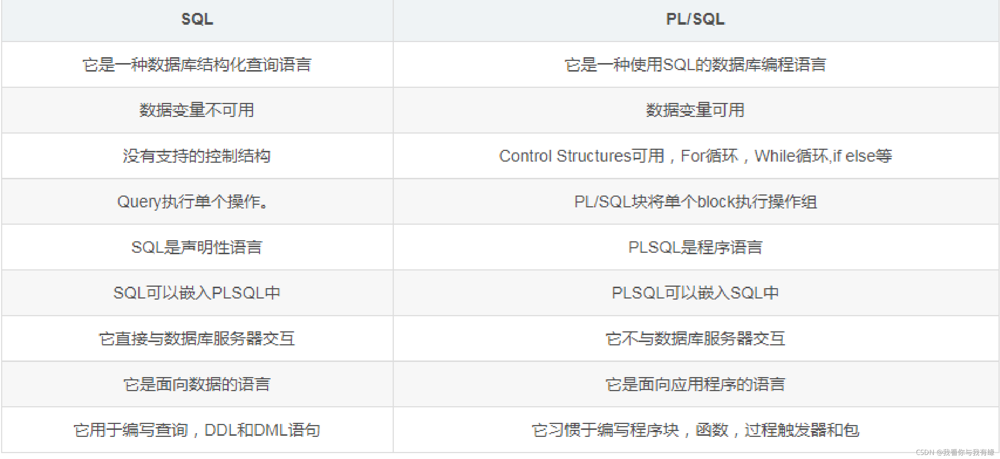
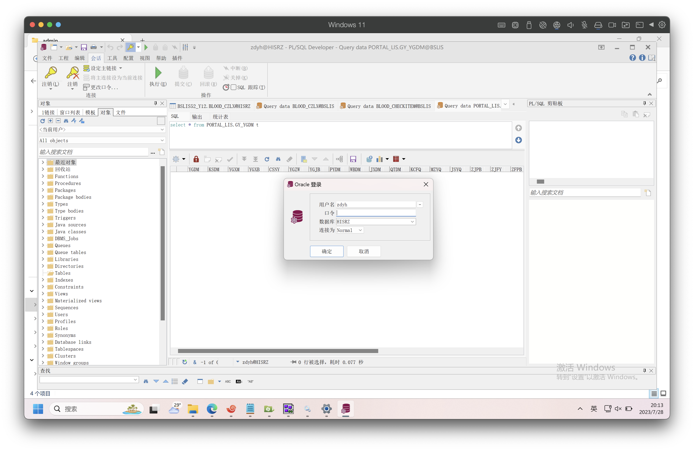

- [Cursor (游标)](#cursor-游标)
  - [Cursor解释](#cursor解释)
  - [Cursor生命周期](#cursor生命周期)
  - [Cursor使用](#cursor使用)
- [Function (函数)](#function-函数)
- [PL/SQL](#plsql)
  - [PL/SQL Syntax (语法)](#plsql-syntax-语法)
  - [EXCEPTION HANDLING(异常处理)](#exception-handling异常处理)
  - [PL/SQL和SQL区别](#plsql和sql区别)
    - [如何查询指定表结构？](#如何查询指定表结构)
    - [如何查询指定schema下的表？](#如何查询指定schema下的表)
- [Type](#type)
  - [Character](#character)
    - [Oracle的字符的汉字编码方式是什么？](#oracle的字符的汉字编码方式是什么)
    - [什么是定长字符串和变长字符串？两者有什么区别？](#什么是定长字符串和变长字符串两者有什么区别)
    - [什么时候使用变长字符串，什么时候使用定长字符串？](#什么时候使用变长字符串什么时候使用定长字符串)
    - [为什么CHAR的长度是固定的？](#为什么char的长度是固定的)
    - [当输入的数据长度大于或小于字符串定义长度时的表现是什么？](#当输入的数据长度大于或小于字符串定义长度时的表现是什么)
    - [CHAR、VARCHAR的优缺点？](#charvarchar的优缺点)
    - [Oracle中的变长字符串类型为何不是VARCHAR1？VARCHAR和VARCAHR2的区别是什么？](#oracle中的变长字符串类型为何不是varchar1varchar和varcahr2的区别是什么)
    - [什么时候分别使用VARCHAR，VARCHAR2？](#什么时候分别使用varcharvarchar2)
    - [varchar2输入空串后，在存储之前就转化为null进行存储，还是说直接存入null？](#varchar2输入空串后在存储之前就转化为null进行存储还是说直接存入null)
  - [Number](#number)
    - [Oracle和Java的数字类型哪个更精准？](#oracle和java的数字类型哪个更精准)
    - [Oracle定点数和浮点数如何定义？](#oracle定点数和浮点数如何定义)
    - [Oracle Number输入的长度超过定义精度会如何表现？](#oracle-number输入的长度超过定义精度会如何表现)
- [Package](#package)
  - [调用存储过程或方法](#调用存储过程或方法)
  - [定义包头](#定义包头)
  - [定义包体](#定义包体)
  - [删除包](#删除包)
  - [授权用户包权限](#授权用户包权限)
  - [授权用户数据表的权限](#授权用户数据表的权限)
  - [package、procedure、function声明时is和as的区别](#packageprocedurefunction声明时is和as的区别)
  - [begin-end结构中，end后是否都需要添加对应名称](#begin-end结构中end后是否都需要添加对应名称)
- [Client](#client)
  - [安装Windows客户端](#安装windows客户端)

-----------------------------------------------------------------------------------------------------------------------------------------------------------------------------------
## Cursor (游标)
### Cursor解释
1. Cursor本质上就是一块内存区域，由系统或用户以变量的形式定义，可以提高数据处理的效率。
2. Cursor将查询出的结果集（多条记录）统一存放至内存中，由游标从内存中获取数据。
3. Cursor能够解决一次性查询多条记录的问题，所以处理多行数据的事务经常使用游标实现。
### Cursor生命周期
1. 创建。定义游标，分配内存区域（内存中没有任何数据）；
2. 开启。存入游标，将结果集存入内存；
3. 提取。提取数据，提取数据时，会提取指针指向的数据，此时指针会指向下一条数据，当提取最后一条数据时，指针指向不存在任何数据的位置，当再次提取数据时found值会变为false，notfound值会变为true。
4. 关闭。关闭游标，释放内存资源。
### Cursor使用
-----------------------------------------------------------------------------------------------------------------------------------------------------------------------------------

## Function (函数)
`trunc()`
`nvl()`
`NVL(expression, replacement_value)`是一个常用的SQL函数，用于处理空值(NULL)，如果第一个参数为NULL，则返回第二个参数，否则返回第一个参数的值。
`over()`
`MOD()`
MOD(x,y)表示x/y的余数。
若求n为奇数或偶数，MOD(n,1)=1表示n为奇数，MOD(n,2)=0表示n为偶数。

-----------------------------------------------------------------------------------------------------------------------------------------------------------------------------------

## PL/SQL
**Procedural Language / Structured Query Language, aka PL/SQL.**

1. PL/SQL是一种用于Oracle数据库的编程语言
2. PL/SQL结合了SQL和过程话编程元素，也就是混合SQL声明和过程结构
3. PL/SQL是过程化语言

### PL/SQL Syntax (语法)
1. Blocks (块)
PL/SQL代码是以块的形式组织的，每个块由关键字BEGIN和END包围。
块是PL/SQL代码的基本执行单元，可以包含声明、异常处理和执行部分。
```SQL
DECLARE -- 声明部分
    -- 变量
    -- 集合
    -- 游标
    -- 类型
    -- 常量
BEGIN -- 执行部分
    -- SQL语句
    -- PL/SQL语句
EXCEPTION -- 异常部分
END;
```
### EXCEPTION HANDLING(异常处理)
```SQL
BEGIN
    -- 执行部分抛出异常
EXCEPTION
    WHEN EXCEPTION1 THEN
        -- 异常1处理
    WHEN EXCEPTION2 THEN
        -- 异常2处理
    WHEN EXCEPTION3 THEN
        -- 其他未处理异常的处理
END;
```

### PL/SQL和SQL区别
<!--  -->
| SQL                          | PL/SQL                                                |
| ---------------------------- | ----------------------------------------------------- |
| 它是一种数据库结构化查询语言 | 他是一种使用SQL的数据库编程语言                       |
| 数据变量不可用               | 数据变量可用                                          |
| 没有支持的控制结构           | Control Structures可用，For循环，While循环，if-else等 |
| Query执行单个操作            | PL/SQL将单个Block执行操作组                           |
| SQL是声明语言                | PL/SQL是程序语言                                      |
| SQL可以嵌入PL/SQL中          | PL/SQL可以嵌入SQL中                                   |
| 直接与数据库服务器交互       | 不与数据库服务器交互                                  |
| 它是面向数据的语言           | 它是面向应用程序的语言                                |
| 它用于编写查询、DDL、DML语句 | 它习惯于编写程序块、函数、过程触发器和包              |

#### 如何查询指定表结构？
``` SQL
select t.COLUMN_NAME,
    decode(s.DATA_TYPE,
        'DATA',
        'DATA',
        s.DATA_TYPE || '(' || s.DATA_LENGTH || ')'),
        t.COMMENTS
    from all_col_comments t, all_tab_columns s
    where t.TABLE_NAME = 'TABLE_NAME'
    and s.TaBLE_NAME = 'TABLE_NAME'
    and t.COLUMN_NAME = s.COLUMN_NAME
order by t.column_name;
```
``` SQL
select ALL_COL_COMMENTS.COLUMN_NAME, decode(ALL_TAB_COLUMNS.DATA_TYPE,'data','data',ALL_TAB_COLUMNS.DATA_TYPE || '('|| ALL_TAB_COLUMNS.DATA_LENGTH ||')'), ALL_COL_COMMENTS.COMMENTS from ALL_COL_COMMENTS,ALL_TAB_COLUMNS
WHERE ALL_COL_COMMENTS.Table_Name='TABLE_NAME' and ALL_TAB_COLUMNS.Table_Name='TABLE_NAME' and ALL_COL_COMMENTS.COLUMN_NAME=ALL_TAB_COLUMNS.COLUMN_NAME order by ALL_COL_COMMENTS.COLUMN_NAME;
```

#### 如何查询指定schema下的表？
`select table_name from sys.dba_tables where owner='SCHEMA'`
`select table_name from all_tables where owner='SCHEMA'`

-----------------------------------------------------------------------------------------------------------------------------------------------------------------------------------

## Type

urowid,rowid,bfile,nclob,clob,blob,interval day to second,interval year to month,timestamp with local time zone,timestamp with time zone,timestamp,date, long raw,long,binary_double,binary_float,number,raw,nvarchar2,varchar2,nchar,∏

### Character
char, nchar

#### Oracle的字符的汉字编码方式是什么？
不同编码方式中汉字占用情况不同，UTF-8（1-3字节）、GB2312（2字节）、GBK（2字节）、GB8030（1、2、4字节）

#### 什么是定长字符串和变长字符串？两者有什么区别？
Oracle中，定长字符串和变长字符串都用于存储字符串类型的数据。
定长字符串使用CHAR定义，表示固定长度的字符串数据类型，长度为2000字节。
变长字符串使用VARCHAR2定义，表示可变长度的字符串数据类型，最大长度为4000字节。
> 注：Oracle 12c版本后，VARCHAR2最大长度为32767字节。

#### 什么时候使用变长字符串，什么时候使用定长字符串？
字段长度固定不变，例如性别、手机号码、身份证号码等数据，使用定长字符串类型存储，即Oracle CHAR；字段长度不确定，例如姓名、学历、地址、URL等数据，使用变长字符串类型进行存储，即Oracle VARCHAR2。

#### 为什么CHAR的长度是固定的？
当数据类型为CHAR时，而存入的字符串数据的内容长度不够是，Oracle将在数据内容后面自动填充空格，以补全数据，所以CHAR的长度总是固定的。

#### 当输入的数据长度大于或小于字符串定义长度时的表现是什么？

#### CHAR、VARCHAR的优缺点？

#### Oracle中的变长字符串类型为何不是VARCHAR1？VARCHAR和VARCAHR2的区别是什么？
**类型性质：**varchar1（实际为varchar）为标准SQL里定义的数据类型，varchar2是Oracle独有的一种数据类型。
**存储长度：**varchar定义固定长度的字符串，varchar2定义可变长度字符串。varchar定义字符串存储长度为2000，varchar2定义存储长度为4000。
**字符编码：**varchar定义中，1个中文字符占用2字节，1个英文字符占用1个字节；varchar2定义，1个中文或英文字符皆占用2字节。
**空串处理：**对于空串处理上，varchar不处理空串，即输入空串存储空串，而varchar2输入空串则代表null。

#### 什么时候分别使用VARCHAR，VARCHAR2？
若要使用变长字符串类型，MySQL最好使用varchar，Oracle则使用varchar2。

#### varchar2输入空串后，在存储之前就转化为null进行存储，还是说直接存入null？

### Number

#### Oracle和Java的数字类型哪个更精准？
Oracle中 Number和Java long,int,double类型都用于存放数字，
Oracle Number精度为38位
Java long 精度 20位
Java int 精度
Java short 精度
Java dobule 精度
Java float 精度
所以说Oracle Number类型比Java数字类型更精准。

#### Oracle定点数和浮点数如何定义？
NUMBER(m,n) m表示总长度 n表示小数位的精度。
如果只输入定点数，则使用NUMBER(m)，m表示可以存入数据的最大位数。

#### Oracle Number输入的长度超过定义精度会如何表现？
使用NUMBER(m,n)定义精度，如果存入的小数位精度超过n，则四舍五入后取值。
例如NUMBER(10,3)，数值总长度为10，小数点后位数位3。
如果输入123.4567，实机数值为123.457。
如果输入123456789.321，总长度超过10，Oracle将提示错误。

-----------------------------------------------------------------------------------------------------------------------------------------------------------------------------------

## Package
* package (包)
Oracle中`package`是由`package`(包头)和`package body`(包体)组成的；

### 调用存储过程或方法
```SQL
-- 当前用户调用scott用户中的package，判断某表是否存在与scott中；
SELECT soctt.pag_public_toolkit.f_whether_table_exists('emp') a,
       scott.pkg_public_toolkit.f_whether_table_exists('student') b
FROM dual;
```

### 定义包头
``` SQL
-- 定义package包头；
CREATE OR REPLACE PACKAGE scott.pkg_public_toolkit IS 
PROCEDURE p_whether_table_exists(i_table_name IN sys.all_tab_comments.table_name%TYPE, o_flag OUT VARCHAR2, o_message OUT VARCHAR2);
FUNCTION f_whether_table_exists(i_table_name IN sys.all_tab_comments.table_name%TYPE) RETURN VARCHAR2;
END pkg_public_toolkit;
-- 授权给用户；
GRANT EXECUTE ON scott.pkg_public_toolkit TO user;
```

### 定义包体
``` SQL
CREATE OR REPLACE PACKAGE BODY scott.pkg_public_toolkit IS
PROCEDURE p_whether_table_exists(i_table_name IN sys.all_tab_comments.table_name%TYPE, o_flag OUT VARCHAR2, o_message OUT VARCHAR2) IS v_count NUMBER(1);
BEGIN
-- 判断用户scott中是否存在表
SELECT COUNT(1) INTO v_count FROM user_tab_comments ust WHERE ust.table=upper(i_table_name);
-- 程序执行描述信息
IF v_count>=1 THEN o_message:='存在';
ELSE o_message:='不存在';
END IF;
-- 程序执行标识
o_flag:='T';
EXCEPTION WHEN OTHERS THEN o_flag:='F';
dbms_output.put_line(dbms_utility.format_error_backtrace); -- 报错行号
dbms_output.put_line(SQLCODE || ':' || SQLERRM);           -- 报错编号及内容
END p_whether_table_exists;
FUNCTION f_whether_table_exists(i_table_name IN sys.all_tab_comments.table_name%TYPE) RETURN VARCHAR2 IS 
o_flag VARCHAR2(2);
o_message VARCHAR2(100);
BEGIN 
p_whether_table_exists(i_table_name => i_table_name,o_flag=>o_flag,o_message=>o_message); RETURN o_message;
END f_whether_table_exists;
END pkg_public_toolkit;
```

### 删除包
``` SQL
-- 删除包
DROP PACKAGE [BODY] [user.]package_name;
-- 删除过程
DROP PRODUCT p_whether_table_exists, OpenCurType;
-- 删除实例中创建的包
DROP PACKAGE demo_pack;
```

### 授权用户包权限
``` SQL
GRANT EXECUTE ON db.pkg TO u1,u2;
```

### 授权用户数据表的权限
``` SQL
GRANT SELECT ON db.table TO user;       --package授权
REVOKE SELECT ON db.table FROM user;    --package收权
-- 授权完成，仅表示'用户n'能够'执行'该pkg，但不能保证'用户n‘能够查询该pkg中的'对象（如：表）
```

### package、procedure、function声明时is和as的区别
在定义package, procedure, function、自定义类型type时，as和is相同无区别；
在声明游标cursor时，只能使用is不能使用as；
在创建视图view时，只能使用as不能使用is。

### begin-end结构中，end后是否都需要添加对应名称
在定义package, procedure, function时，begin-end结构的end结束后都需要携带相映名称；
当定义匿名语句块时，begin-end结构的end结束后不需要携带名称，如：
``` SQL
begin
    -- pl/sql语句
end
```

-----------------------------------------------------------------------------------------------------------------------------------------------------------------------------------

## Client

### 安装Windows客户端
1. Install Oracle Client (安装Oracle客户端)

2. Install PLSQL Developer (安装PL/SQL环境)

3. configure tnsnames.ora (客户端配置)
Path：
C:\Oracle\product\12.2.0\client_1\network\admin
粘贴或配置`tnsnames.ora`
1. Login PLSQL Server (登录)
