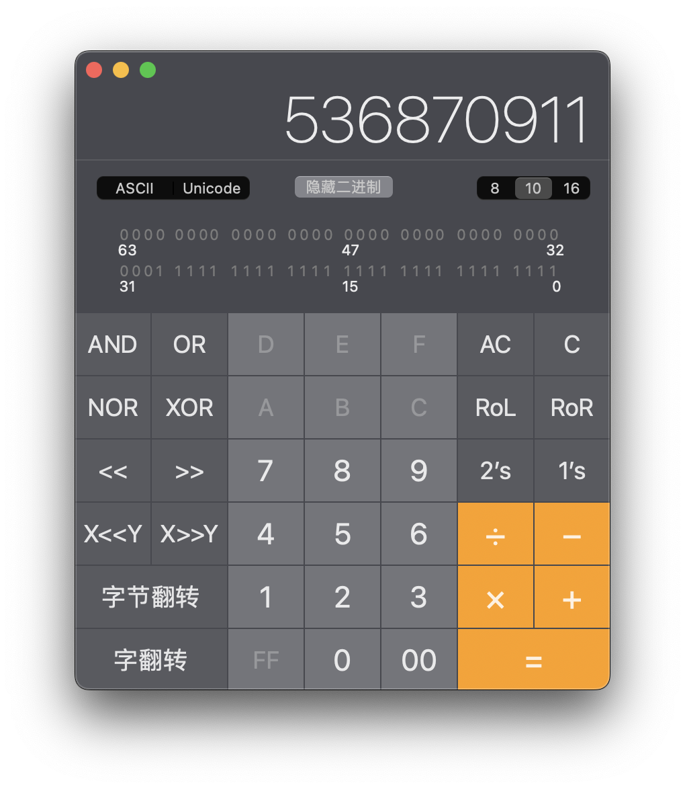

## 为什么要有线程池？

1. 为什么要创建线程去执行任务？
   * 提升用户的好感度和体验
   * 为了更好地利用服务器的硬件资源

2. 如果每次执行异步任务，都需要重新构建一个线程，处理完再销毁掉，消耗系统资源。
   * 池化思想：可以事先构建好一些线程，存在一个池子里，什么时候用什么时候掏出来，用完再放回去。

3. 单纯地使用池化，不足以解决某些问题
   * 如果过多地构建线程，会造成反向结果，导致系统变慢
   * 想统计线程池处理的任务数量

> JDK提供了功能非常强大的线程池，就是ThreadPoolExecutor。

## 线程池的核心属性CTL？

``` Java
//====================控制初始化==============================
//AtomicInteger可以看成是一个线程安全的int类型
private final AtomicInteger ctl=new AtomicInteger(ctlof(RUNNING,0));
//ctl在线程池中表示着两个含义：
//1. ctl表示着线程池的状态，高3位的bit，表示线程池状态；
//2. ctl表示着线程池中的工作线程个数，低29位表示工作线程的个数。
//一个int类型有32个bit位。
//private int ctl;
//CTL规定了线程池中的工作线程最多能达到536870911个工作线程，但是现在的硬件条件，肯定到不了。

//====================计算工作线程==============================
//private static final int COUNT_BITS=Integer.SIZE-3;
//方便计算，先搞个29
private static final int COUNT_BITS=29;
//将1，左移29位，-1，得到工作线程允许的最大值。
private static final int CAPACITY=(1<<COUNT_BITS)-1;
/*
capacity表示的二进制位：
00100000 00000000 00000000 00000000
00011111 11111111 11111111 11111111
 */

//====================线程池状态==============================
// runState is started in the high-order bits
private static final int RUNNING=-1<<COUNT_BITS;
private static final int SHUTDOWN=0<<COUNT_BITS;
private static final int STOP=1<<COUNT_BITS;
private static final int TIDYING=2<<COUNT_BITS;
private static final int TERMINATED=3<<COUNT_BITS;
```

> 线程池总共能创建多少个线程？  
> CTL中的int位低29位代表工作线程个数。  
> 

## 线程池构造

通常情况下，使用对应的构造方法构建线程池。

### 构建线程池必备的参数？
了解线程池的核心属性CTL后，还要掌握线程池的7个核心参数。
在通过有参构造方法构建线程池对象时，需要去填充这7个参数。
说人话，就是构造的7个参数。
``` Java
//ThreadPoolExecutor完整参数构造
public ThreadPoolExecutor(
    int corePoolSize,
    int maximumPoolSize,
    long keepAliveTime,
    TimeUnit timeUnit,
    BlockingQueue<Runnable> workQueue,
    ThreadFactory threadFactory,
    RejectedExecutorHandler handler
){}
```
1. 核心线程数：类比正式公司员工
2. 最大核心数：类比公司员工总数（包含外包） maximumPoolSize - corePoolSize = 外包人数
3. 最大空闲时间：非核心线程可以空闲多长时间，时间到了，直接干掉（**非核心是否占用空间问题**）
4. 空闲时间单位：可以设置为妙、毫秒、微秒、纳秒
5. 工作队列：核心线程都忙着的时候，再来任务，优先排队（**非核心线程是否参与问题**）
6. 线程工厂：需要传入构建线程时的一些信息
7. 拒绝策略：当所有的工作线程都忙着呢，工作队列任务排满了，此时再提交任务会被拒绝，使用对应拒绝策略。

### 线程池一共定义了几个构造方法，它们具有哪些参数？

### 线程池的构造方法们之间有什么关系？

### 线程池的构造方法参数哪些是固定的？哪些是可选的？

### 拒绝策略
**思考：**
**什么是拒绝策略？一共有几种拒绝策略？拒绝策略在线程池中起到什么作用？具体的常用应用在哪方面？如何定义和使用拒绝策略？**

| policy              | explain                                              |
| ------------------- | ---------------------------------------------------- |
| AbortPolicy         | 直接抛异常（默认）                                   |
| DiscardPolicy       | 任务直接丢弃（什么都不做）                           |
| DiscardOldestPolicy | 将工作队列排在最前面的任务丢弃，再次尝试执行当前任务 |
| CallerRunsPolicy    | 调用者自己执行当前任务                               |

如果要求业务上任务执行的完整性，可以使用`AbortPolicy`和`CallerRunsPolicy`这种任务不丢失策略；如果比较注重系统的响应性和吞吐量，则使用`DiscardOldestPolicy`或者`DiscardPolicy`这种丢弃型策略。
> 在选择拒绝策略的时候，应当考虑具体的业务需求和应用场景，选择或平衡**任务执行的完整性**和**系统性能**，从而避免对系统产生不良影响。

#### 线程池的默认拒绝策略（Execution Default Reject Policy）
思考：在线程池默认的拒绝策略下，被拒绝的任务去了哪里？如何处理这些抛出异常的任务？默认拒绝策略本质上和其他拒绝策略有什么不同吗？
默认拒绝策略会在接收任务后抛出异常，如果不进行任何处理，本质上和DiscardPolicy没有区别

## 线程池生命周期
思考：一个线程如何进入线程池？线程池如何处理提交的任务？任务就是线程吗？
