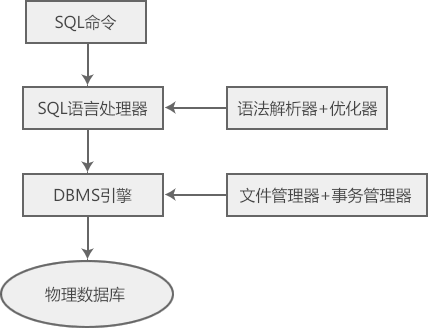

- [SQL Class (语言类型)](#sql-class-语言类型)
  - [SQL Elements (语言元素)](#sql-elements-语言元素)


### SQL History (语言发展史)
1. 1970
IBM的Edgar Frank "Ted" Codd博士描述了关系型数据库的模型，因此被称为“关系型数据库之父”。
2. 1974
IBM希望将Frank的想法变为现实，于是着手开发一款名为System R的数据库，并研发出一套结构化查询语言SEQUEL，它就是SQL的雏形。1970年代初期，Donald D.Chamberlin 和 Raymond F. Boyce 从Edgar F. Codd那里了解到关系模型后，在IBM公司开发而出。最初版本称为SEQUEL（结构化英语查询语言），旨在操作和检索存储在IBM原始准关系数据库管理系统(System R)中的数据（该系统是IBM圣何塞研究实验室在1970年代开发的）。
> SQL是第一个使用 Edgar F.Codd 关系模型的商用语言。
3. 1978
System R数据库第一次发布，主要用于科研和实验。
4. 1979
Oracle公司首先提出商用SQL，随后IBM公司也在DB2数据库实现了SQL。
5. 198610
美国ANIS采用SQL作为RDBMS的标准语言，紧接着ISO也将SQL采纳为国际标准。
> 该标准的新版本分别于1989、1992、1996、1999、2003、2006、2008、2011、2016年发布。
6. 1989
ANSI发布SQL标准的重大更新版本，弥补旧版的不足，被称为ANSI SQL 89，该版本也被ISO采纳。
> 尽管存在标准，但是大多数SQL代码在移植到不同的数据库系统之前至少需要进行一定的修改。

### SQL Execute (语言执行过程)

**传统查询引擎能够处理所有非SQL命令，但是SQL引擎并不能处理逻辑文件。**

```
SQL输入
    ↓
系统确定执行请求的最佳方式
    ↓
SQL引擎翻译SQL语句 → 处理请求任务
    ↓
物理数据库
```

## SQL Class (语言类型)
最初基于关系代数和元祖关系演算，SQL由许多类型语句的，可以被非正式地归类为子语言，常用：一个数据查询语言(DQL)，一个数据定义语言(DDL)，一个数据控制语言(DCL)，数据操纵语言(DML)
SQL的范围包括数据查询和操作（插入、更新、删除 / 增删改查）、数据定义（模式创建和修改），数据访问控制。
虽然SQL本质上是一个声明性语言，但它还包括过程元素。

**DDL：Data Definition Language (数据定义语言)**

DDL允许用户定义数据，也就是创建表、删除表、修改表结构这些操作。通常，DDL由数据库管理员执行。
| KEYWORD  | INSTRUCT                           |
| -------- | ---------------------------------- |
| CREATE   | 在数据库中创建新表、视图或其他对象 |
| ALTER    | 在数据库中修改表或视图             |
| DROP     | 在数据库中删除表、视图或其他对象   |
| TRUNCATE |                                    |

**DML：Data Manipulation Language (数据操作语言)**

DML为用户提供添加、删除、更新数据的能力，这些是应用程序对数据库的日常操作。
| KEYWORD | INSTRUCT |
| ------- | -------- |
| INSERT  | 插入记录 |
| UPDATE  | 更新记录 |
| DELETE  | 删除记录 |


**DQL：Data Query Language (数据查询语言)**

DQL允许用户查询数据，这也是通常最频繁的数据库日常操作。
| KEYWORD | INSTRUCT |
| ------- | -------- |
| SELECT |          |

**TCL: Transaction Control Language (事务控制语言)**

| KEYWORD  | INSTRUCT |
| -------- | -------- |
| COMMIT   | 提交事务 |
| ROLLBACK | 回滚事物 |

**DCL: Data Control Language (数据控制语言)**

| KEYWORD | INSTRUCT       |
| ------- | -------------- |
| GRANT   | 向用户分配权限 |
| REVOKE  | 收回用户权限   |

### SQL Elements (语言元素)
