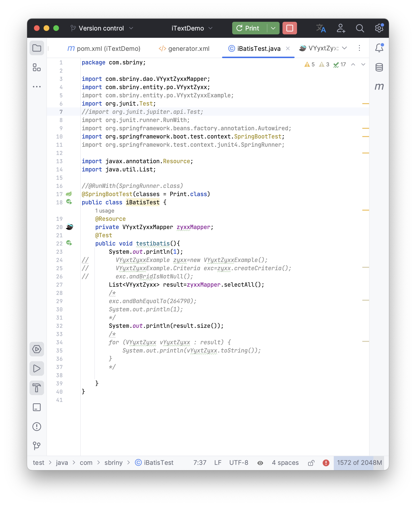
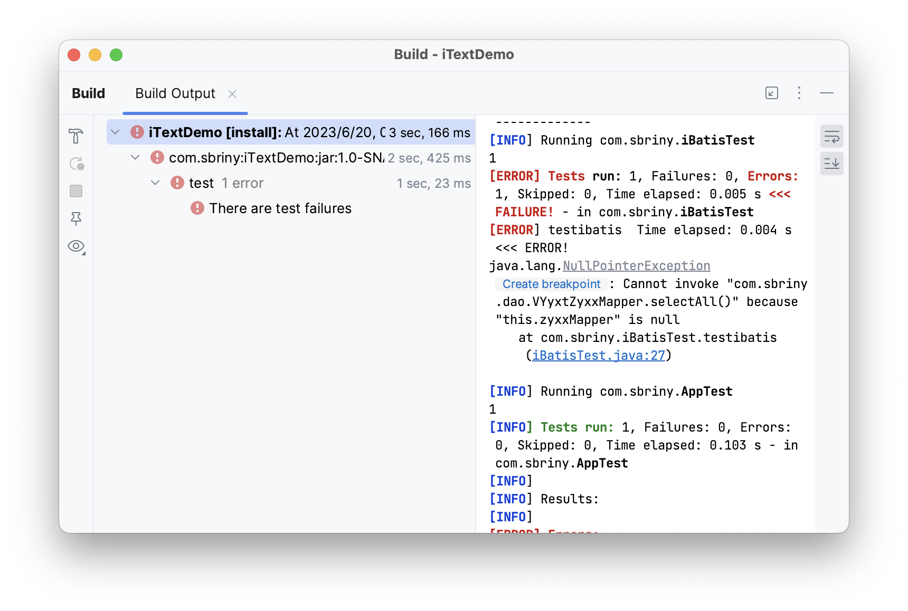
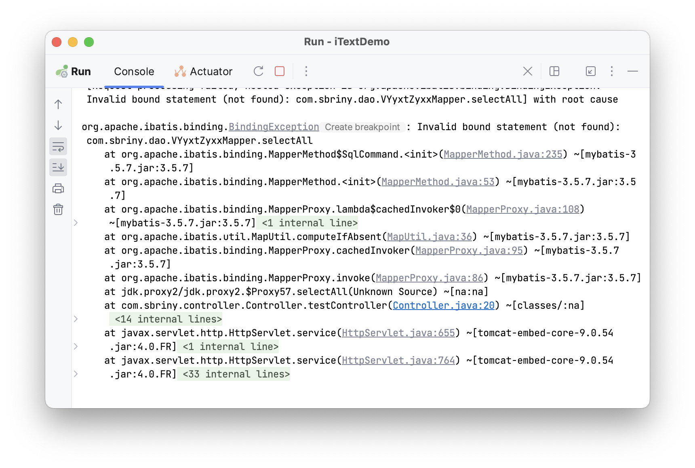
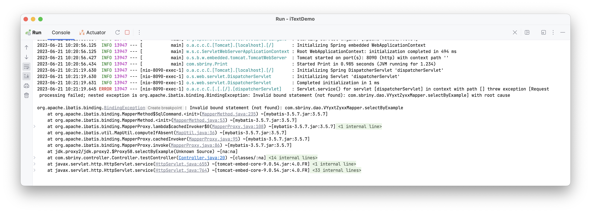
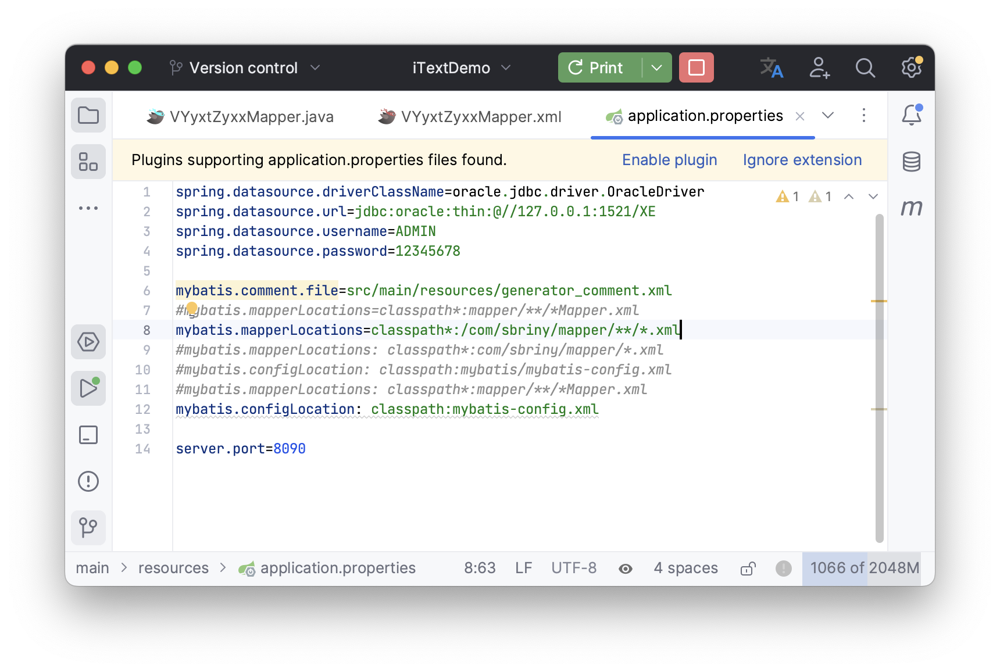

SpringbootTest 在测试中遇到的问题

## 测试框架中，无法加载Mapper
描述：在SpringBootTest类中测试Genenrator代码的有效性，运行时报错。
报错信息：  
`java.lang.NullPointerException: Cannot invoke because "this.Mapper" is null`


原因：因为导入了错误的Test注解类。
使用`@Test`注解：  
`import org.junit.Test;`（错误）
`import org.junit.jupiter.api.Test;`（正确）
解决：使用正确的导入类。

## 移动Mapper包后无法invoke
描述：将XML Mapper包从resource移动至main后，编译时报错。
错误信息：
`org.apache.ibatis.binding.BindingException: Invalid bound statement (not found): Mapper.selectAll`

原因：因为移动了Mapper资源路径后，没有修改MyBatis Mapper Location路径，所以无法找到Mapper包路径。
解决：保证MyBatis Mapper Location包路径正确。

## 无法使用MAPPER映射类的方法
错误信息：
```
Servlet.service() for servlet [dispatcherServlet] in context with path [] threw exception [Request processing failed; nested exception is org.apache.ibatis.binding.BindingException: Invalid bound statement (not found): com.sbriny.dao.VYyxtZyxxMapper.selectByExampleWithBLOBs] with root cause

org.apache.ibatis.binding.BindingException: Invalid bound statement (not found): com.sbriny.dao.VYyxtZyxxMapper.selectByExampleWithBLOBs
```

原因分析：
无法找到映射关系中的Mapper方法，原因可能为：没有添加映射类注解；映射包路径配置错误；Mapper XML内容错误。查找问题根源为Mapper包路径错误。
问题解决：
修改映射包路径为相对路径，并分别针对Mapper在main/java和main/resource中做出不同的路径。
